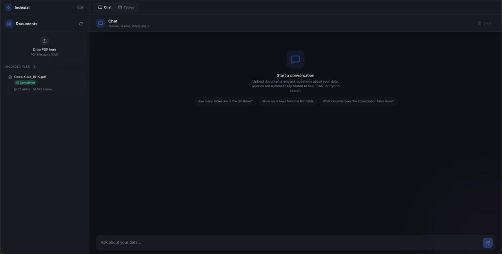

# Indexial

An intelligent document query system that combines **RAG** (Retrieval-Augmented Generation) with **NL-to-SQL** to let users upload PDFs, extract structured tables and unstructured text, and query everything through natural language.




---

## Architecture

```
PDF Upload
    |
    v
Mistral OCR --> Markdown Extraction
    |
    +--> Table Extraction --> Dynamic PostgreSQL Tables + Table Registry
    |
    +--> Text Chunking --> Jina Embeddings (1024-dim) --> pgvector Storage
    |
    v
Natural Language Query
    |
    v
Heuristic + LLM Query Router
    |
    +--> SQL Path ----> LLM generates SQL --> Six-Layer Safety --> Execute
    |
    +--> RAG Path ----> Semantic Search --> Context Assembly --> LLM Answer
    |
    +--> HYBRID -----> Both paths merged
    |
    v
Response with Sources, SQL, and Explanation
```

## Key Features

### Intelligent Query Routing
Queries are classified into **SQL**, **RAG**, or **HYBRID** paths using a two-phase system: fast heuristic pattern matching followed by LLM-based classification as a fallback. Queries about numbers, comparisons, and aggregations route to SQL. Conceptual and descriptive queries route to RAG. Ambiguous queries run both.

### Six-Layer SQL Safety
LLM-generated SQL passes through six validation layers before execution:
1. **Keyword Blocklist** -- Rejects DML/DDL keywords (INSERT, DROP, ALTER, etc.)
2. **Statement Validation** -- Only SELECT statements allowed
3. **Table Whitelisting** -- Queries restricted to tables present in the registry
4. **Read-Only Connection** -- Database connection enforced as read-only at the driver level
5. **Row Limits** -- Results capped to prevent memory exhaustion
6. **Query Timeouts** -- Execution time bounded to prevent long-running queries

### Automatic Table Extraction and Ingestion
Tables found in PDFs are automatically extracted, stitched across page boundaries (handling multi-page tables), and loaded into dedicated PostgreSQL tables with LLM-generated schemas. Each table is registered with semantic descriptions for natural language discovery.

### Session-Aware Conversations
Per-session memory tracks conversation history and automatically rewrites follow-up queries into standalone questions. Asking "What about last year?" after a revenue query becomes "What was the revenue last year?" -- enabling multi-turn conversations without losing context.

### Semantic Search with pgvector
Text is chunked with heading and section context preserved, embedded using Jina AI (1024 dimensions), and stored in PostgreSQL with pgvector. Retrieval uses cosine similarity with configurable score thresholds.

### Automatic Database Lifecycle Management
The system auto-resets after 2 hours of inactivity via a background timer thread, and on browser tab close via `navigator.sendBeacon`. All extracted tables, embeddings, documents, and uploaded files are cleaned up, returning the system to a fresh state.

---

## Tech Stack

| Layer | Technology |
|-------|-----------|
| LLM | Groq (Llama 3.1 8B Instant) |
| OCR | Mistral (Pixtral) |
| Embeddings | Jina AI (jina-embeddings-v3, 1024-dim) |
| Database | Supabase PostgreSQL + pgvector |
| Backend | Flask + Flask-CORS |
| Frontend | Next.js 16 + shadcn/ui + Tailwind CSS |

---

## Project Structure

```
indexial/
├── app.py              # Flask REST API (8 endpoints)
├── router.py           # Query classification and orchestration
├── sql_engine.py       # NL-to-SQL generation + six-layer safety
├── retrieval.py        # Semantic search over pgvector
├── chunker.py          # Text chunking + embedding storage
├── table_parser.py     # Table extraction, stitching, and ingestion
├── pipeline.py         # End-to-end document processing pipeline
├── extractor.py        # Mistral OCR extraction
├── embeddings.py       # Jina AI embedding client
├── llm.py              # Groq LLM client (SQL gen, classification, answers)
├── memory.py           # Thread-safe session conversation memory
├── db.py               # PostgreSQL connection management
└── frontend/           # Next.js application
    ├── app/            # Pages and layout
    ├── components/     # UI components (chat, sidebar, tables view)
    └── lib/            # API client and type definitions
```

---

## Setup

### Prerequisites
- Python 3.11+
- Node.js 18+
- A Supabase project with pgvector enabled

### Environment Variables

Create a `.env` file in the root directory:

```env
SUPABASE_DB_URL=postgresql://...
GROQ_API_KEY=gsk_...
JINA_API_KEY=jina_...
MISTRAL_API_KEY=...
```

### Backend

```bash
# Install dependencies
uv sync  # or pip install -r requirements.txt

# Start the API server
uv run python app.py
```

The API runs on `http://localhost:8000` by default.

### Frontend

```bash
cd frontend
npm install --legacy-peer-deps
npm run dev
```

The frontend runs on `http://localhost:3000` and proxies API calls to the backend.

---

## API Endpoints

| Method | Endpoint | Description |
|--------|----------|-------------|
| GET | `/health` | Health check |
| POST | `/api/documents/upload` | Upload a PDF for processing |
| GET | `/api/documents` | List all documents (with optional status filter) |
| GET | `/api/documents/<id>` | Get document details |
| POST | `/api/query` | Execute a natural language query |
| POST | `/api/sessions/<id>/clear` | Clear session conversation history |
| POST | `/api/reset` | Reset entire database to initial state |
| GET | `/api/tables` | List all extracted tables |

---

## Usage

1. **Upload** a PDF through the sidebar. The system extracts text and tables automatically.
2. **Query** in natural language. The router picks the best execution path:
   - *"What was the total revenue in Q3?"* --> SQL
   - *"Summarize the key findings"* --> RAG
   - *"Compare the revenue figures with the report conclusions"* --> HYBRID
3. **Follow up** naturally. Session memory resolves pronouns and references from prior turns.
