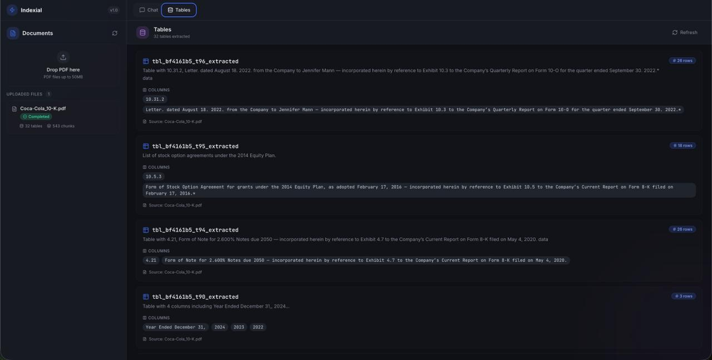

# Indexial

Ask questions about your PDFs and get answers with charts attached — where every
number comes from SQL over extracted table data, and no language model ever draws
the chart.




---

## What it does

Upload a PDF. Indexial OCRs it, pulls out the tables, stores every cell as a fact
with its row, column and page, and embeds the prose into pgvector. Then you ask
questions in plain language and it decides whether the answer lives in the tables
(SQL), the text (RAG), or both.

Numeric answers come back with a chart or table built from the actual result set.

## Two design decisions worth knowing about

**Charts are chosen by the shape of the data, not by the model.** A classifier
reads the result set — column types from Postgres type OIDs, row counts, whether
there is a time axis — and picks from a fixed catalogue. `query/artifacts.py`
imports no LLM, no database and no HTTP client, and a test enforces that by parsing
its own imports. Because nothing generative sits between the verified rows and the
pixels, a chart cannot misrepresent the data; the worst it can do is pick a duller
chart than you would have.

**All table data lives in one table.** Every extracted cell becomes a row in
`document_facts` with `(document_id, table_id, row_index, col_index, page_number,
column_key, row_label, value_text, value_num, unit, value_type)`. Earlier versions
asked the LLM to write a `CREATE TABLE` per extracted table, which meant the SQL
prompt grew with every upload, cross-document questions needed a join between two
schemas the model had just invented, and no row index or page was recorded anywhere.

That choice has a real cost: aggregation over long-format data needs a pivot. It is
paid for in `query/sql_templates.py` — because the schema never changes, the model
fills slots in a canned query pattern instead of composing SQL, and Python renders
parameterised SQL from a template.

---

## Architecture

```
PDF
 └─ Mistral OCR ──► pages (markdown, page numbers preserved)
      ├─ tables ──► stitched across page breaks ──► document_facts   (one row per cell)
      │                                             table_registry   (catalogue)
      └─ prose  ──► semantic chunks ──► Jina v3 ──► document_chunks  (pgvector, HNSW)

question
 └─ router: heuristics ──► LLM fallback ──► SQL | RAG | HYBRID
      ├─ SQL  ──► catalogue lookup ──► slot filling ──► template ──► AST validation ──► execute
      │            └─ shape classifier ──► chart / table / scalar
      ├─ RAG  ──► cosine search over pgvector ──► answer with sources
      └─ HYBRID ──► both, merged (artifact flagged as computed, prose as merged)
```

### Safety on generated SQL

Validation runs on a parsed AST (`sqlglot`), not regexes:

1. Exactly one statement — `SELECT 1; DROP TABLE documents` has one semicolon and
   used to pass a `count(";") > 1` check
2. Read-only root node
3. No write nodes or filesystem/network functions anywhere in the tree — a column
   named `update` is a column, not an `UPDATE`
4. Relations whitelisted by exact name — the old check accepted anything beginning
   with `tbl_`
5. A mandatory `table_id` / `document_id` predicate — long format has no implicit
   scope, so an unscoped query would read every document at once
6. Outermost `LIMIT` only, a read-only session, and a statement timeout

---

## Stack

| Layer | Technology |
|---|---|
| LLM | Groq `openai/gpt-oss-20b` |
| OCR | Mistral `mistral-ocr-latest` |
| Embeddings | Jina `jina-embeddings-v3` (1024-dim) |
| Database | Supabase PostgreSQL + pgvector (HNSW) + pg_trgm |
| SQL safety | sqlglot AST validation |
| Backend | Flask + flask-cors, Python 3.12 |
| Frontend | Next.js 16, React 19, Tailwind, Radix/shadcn, Recharts |

---

## Layout

```
indexial/
├── backend/
│   ├── indexial/
│   │   ├── api/          Flask app and endpoints
│   │   ├── core/         config, database, schema (all DDL)
│   │   ├── ingest/       OCR, table extraction, cell parsing, fact storage, chunking
│   │   ├── query/        routing, SQL generation, validation, retrieval, artifacts
│   │   └── providers/    Groq and Jina clients
│   ├── tests/
│   └── scripts/          manual smoke scripts
├── frontend/             Next.js app
└── docs/
```

---

## Setup

### Prerequisites

- Python 3.12+, Node 18+, [uv](https://docs.astral.sh/uv/)
- A Supabase project (or any Postgres 15+)

### Configure

```bash
cp .env.example .env
```

Fill in `DIRECT_URL`, `GROQ_API_KEY`, `JINA_API_KEY` and `MISTRAL_OCR`.
`.env.example` documents each one. Two things that will otherwise cost you an hour:

- **Use the session pooler (port 5432), not the transaction pooler (6543).** The
  code relies on session-scoped state — `set_session(readonly=True)` and
  `SET statement_timeout` — which pgbouncer's transaction pooling does not keep.
- **Percent-encode special characters in the password.** An unencoded `@` makes
  every URL parser split at the wrong place; encode it as `%40`.

Then verify everything before running anything:

```bash
cd backend
uv sync --extra dev
uv run python -m indexial.core.config
```

That probes all four providers and prints a pass/fail table.

### Run

```bash
# backend, from backend/
uv run python -m indexial.core.schema     # create tables (idempotent)
uv run python -m indexial.api.app         # http://localhost:8000

# frontend, from frontend/
npm install --legacy-peer-deps
npm run dev                               # http://localhost:3000
```

There is no Next.js proxy; the frontend calls the API cross-origin and the backend
sets CORS. Point it elsewhere with `NEXT_PUBLIC_API_URL`.

### Test

```bash
cd backend && uv run pytest
```

The suite needs no database and no API keys: cell parsing, SQL validation and
artifact classification are all pure functions.

---

## API

| Method | Endpoint | Description |
|---|---|---|
| GET | `/health` | Health check |
| POST | `/api/documents/upload` | Upload a PDF (multipart field `file`) |
| GET | `/api/documents` | List documents and processing status |
| GET | `/api/documents/<id>` | One document |
| POST | `/api/query` | Ask a question |
| GET | `/api/tables` | List extracted tables |
| POST | `/api/sessions/<id>/clear` | Clear conversation history |
| POST | `/api/reset` | Wipe everything |

`/api/query` always returns `answer`, `route`, `query`, `original_query` and
`artifacts` (possibly empty). Everything else varies by route.

An artifact carries its own provenance — the SQL that produced it, the true row
count, whether the data was truncated, and `answer_is_llm_merged`, which is true on
HYBRID where the prose is a model merge while the artifact is not.

---

## Notes

Uploaded documents are **ephemeral by design**. Everything is wiped after two hours
of inactivity and when the browser tab closes. `INACTIVITY_TIMEOUT_SECONDS` controls
the timer.

Groq's free tier allows 8000 tokens per minute, and a HYBRID query makes four model
calls, so rate limiting is a normal operating condition rather than an edge case.
The client backs off and retries on 429, and retries once with a larger budget when
a reasoning model spends its whole allowance thinking before emitting any JSON.
